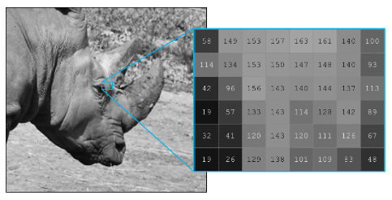
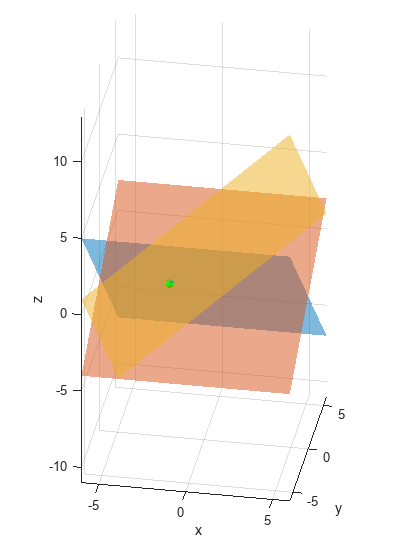
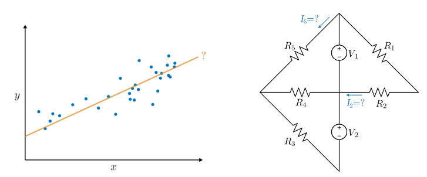
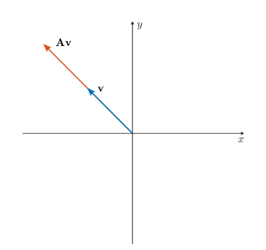
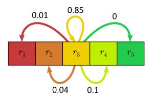

# 선형 대수학의 행렬 방법

 or 

**교육 모듈**

_R2020b로 제작되었습니다. R2020b 및 이후 릴리스와 호환됩니다._

# 정보

이 커리큘럼 모듈에는 일반적으로 입문 선형 대수 과정의 기본 행렬 방법을 가르치는 대화형 [MATLAB® 라이브 스크립트](https://www.mathworks.com/products/matlab/live-editor.html)가 포함되어 있습니다. 각 라이브 스크립트의 첫 번째 부분에서 학생들은 표준 정의를 배우고, 개념을 시각화하고, 종이에 연습을 합니다. 그런 다음 학생들은 보완적인 MATLAB® 방법을 연습합니다. 이러한 방법은 논의된 개념을 강화하고 학생들이 계산 소프트웨어에 대한 초기 친숙함을 개발하는 데 도움이 됩니다. 각 수업은 응용 사례를 설명하며 마무리되며, 이들은 그림과 함께 설명하고 있습니다. 

## 배경

이러한 라이브 스크립트를 강의, 수업 활동 또는 수업 외의 대화형 과제에서 데모로 사용할 수 있습니다. 이 모듈은 행렬 연산, 선형 시스템, 행렬식, 고유값 및 고유 벡터, 대각화와 같은 주제를 다룹니다. 또한 행렬 방법을 사용하여 회색조 이미지를 수정하고, 선형 회로를 분석하고, 진동을 이해하고, 마르코프 체인을 이해하는 예도 포함되어 있습니다. 

라이브 스크립트 내의 지침은 연습과 활동을 안내합니다. 한 번에 한 섹션씩 실행하여 각 라이브 스크립트를 시작합니다. 스크립트나 섹션의 실행을 중간에 중지하려면(예: 애니메이션이 진행 중일 때) MATLAB Toolstrip의 **Live Editor** 탭의 **RUN** 섹션에서  중지 버튼을 사용합니다. 

## 문의하기

해답은 강사의 요청에 따라 제공됩니다. 해답을 요청하거나 피드백을 제공하거나 질문이 있는 경우 [MathWorks 교육 리소스 팀](mailto:onlineteaching@mathworks.com)에 문의하세요.

## 시작하기
### 모듈 접근하기
### **MATLAB Online에서:**

 링크를 사용하여 모듈을 다운로드합니다. 로그인하거나 MathWorks 계정을 만들라는 메시지가 표시됩니다. 프로젝트가 로드되고 시작하는 데 도움이 되는 여러 탐색 옵션이 있는 앱이 표시됩니다. 

### **데스크탑에서:**

이 리포지토리를 다운로드하거나 복제합니다. MATLAB을 열고 이러한 스크립트가 있는 폴더로 이동한 다음 [MatrixMethods.prj](https://matlab.mathworks.com/open/github/v1?repo=MathWorks-Teaching-Resources/Matrix-Methods-of-Linear-Algebra_ko&project=MatrixMethods.prj)을 더블 클릭합니다. MATLAB 경로에 적절한 파일을 추가하고 시작할 위치를 묻는 앱이 열립니다.

필요한 모든 제품이 설치되어 있는지 확인하세요([아래 목록 참조](#H_E850B4FF)). 제품을 추가해야 하는 경우 Add-On Explorer를 사용하여 추가하세요. 애드온을 설치하려면 **Home** 탭으로 이동하여  **Add-Ons** > **Get Add-Ons**를 선택하세요.

## 제품

MATLAB®이 전반적으로 사용됩니다. Symbolic Math Toolbox™, Statistics and Machine Learning Toolbox™, Image Processing Toolbox™의 도구들도 사용됩니다.

# 스크립트

*R2023b 이전 버전의 MATLAB에서 이 내용을 보고 있는 경우 각 스크립트의 학습 결과를* [*여기*](https://www.mathworks.com/matlabcentral/fileexchange/173110)에서 확인할 수 있습니다.

## [**MatrixOperations_ko.mlx**](https://matlab.mathworks.com/open/github/v1?repo=MathWorks-Teaching-Resources/Matrix-Methods-of-Linear-Algebra_ko&project=MatrixMethods.prj&file=Scripts/MatrixOperations_ko.mlx)
|  | **이 스크립트에서 학생들은...**  -  행렬과 그 기본 산술 연산을 정의합니다  -  종이와 MATLAB에서 행렬 연산의 결과를 계산합니다  -  행렬 연산의 크기 요구 사항을 설명합니다  -  MATLAB에서 기호 및 숫자 행렬 연산을 비교합니다  -  회색조 이미지를 수정하기 위해 행렬 방법을 적용합니다 | **학문 분야**  -  선형대수  -  이미지 처리  |
| :-- | :-- | :-- |

## [**LinearSystems_ko.mlx**](https://matlab.mathworks.com/open/github/v1?repo=MathWorks-Teaching-Resources/Matrix-Methods-of-Linear-Algebra_ko&project=MatrixMethods.prj&file=Scripts/LinearSystems_ko.mlx)
|  | **이 스크립트에서 학생들은...**  -  행렬 형태로 선형 시스템을 작성합니다  -  3차원에서 선형 시스템의 해를 시각화와 연관시킵니다  -  행 감소 및 역행렬을 사용하여 선형 방정식 시스템을 풉니다  -  행렬식 관점에서 선형 시스템의 풀이 가능성을 설명합니다  -  MATLAB을 사용하여 선형 시스템을 풉니다 | **학문 분야**  -  선형대수  |
| :-- | :-- | :-- |

## [**LinearSystemsApplications_ko.mlx**](https://matlab.mathworks.com/open/github/v1?repo=MathWorks-Teaching-Resources/Matrix-Methods-of-Linear-Algebra_ko&project=MatrixMethods.prj&file=Scripts/LinearSystemsApplications_ko.mlx)
|  | **이 스크립트에서 학생들은...**  -  선형 회귀 및 선형 회로 분석에 행렬 방법을 적용합니다 | **학문 분야**  -  선형대수  -  통계 분석  -  회로 분석  |
| :-- | :-- | :-- |

## [**Eigenanalysis_ko.mlx**](https://matlab.mathworks.com/open/github/v1?repo=MathWorks-Teaching-Resources/Matrix-Methods-of-Linear-Algebra_ko&project=MatrixMethods.prj&file=Scripts/Eigenanalysis_ko.mlx)
|  | **이 스크립트에서 학생들은...**  -  2차원에서 고유벡터를 시각화합니다  -  종이에서 2x2 행렬의 고유값과 고유벡터를 풀고, MATLAB을 사용하여 더 큰 행렬을 풉니다  -  종이에서 2x2 행렬을 대각화하고, MATLAB에서 더 큰 행렬을 대각화합니다  -  고유값 관점에서 선형 시스템의 해 가능성을 설명합니다  -  결함 있는 행렬에 대해 논의합니다 | **학문 분야**  -  선형대수  |
| :-- | :-- | :-- |

## [**EigenanalysisApplications_ko.mlx**](https://matlab.mathworks.com/open/github/v1?repo=MathWorks-Teaching-Resources/Matrix-Methods-of-Linear-Algebra_ko&project=MatrixMethods.prj&file=Scripts/EigenanalysisApplications_ko.mlx)
|  | **이 스크립트에서 학생들은...**  -  고유 분석을 사용하여 진동과 마르코프 체인의 장기적 거동을 이해합니다 | **학문 분야**  -  선형대수  -  물리 시스템  -  통계 모델링  |
| :-- | :-- | :-- |

# 관련 코스웨어 모듈

## [Vector Arithmetic](https://www.mathworks.com/matlabcentral/fileexchange/94555-vector-arithmetic)
|  | **제공:**     [GitHub](https://github.com/MathWorks-Teaching-Resources/Vector-Arithmetic)   |
| :-- | :-- |

## [Applied Linear Algebra](https://www.mathworks.com/matlabcentral/fileexchange/136364-applied-linear-algebra)
|  | **제공:**     [GitHub](https://github.com/MathWorks-Teaching-Resources/Applied-Linear-Algebra)  |
| :-- | :-- |

또는 다른 [모듈식 코스웨어 콘텐츠](https://www.mathworks.com/matlabcentral/fileexchange/?q=tag%3A%22courseware+module%22&sort=downloads_desc_30d)를 탐색해 보세요.

# 교육자 리소스
-  [교육자 페이지](https://www.mathworks.com/academia/educators.html) 

# 기여하기 

더 많은 정보를 찾고 계신가요? 문제를 발견하셨나요? 제안이 있으신가요? [MathWorks 교육 리소스 팀](mailto:%20onlineteaching@mathworks.com)에 문의해 주세요. 이 프로젝트에 직접 기여하고 싶다면, GitHub의 [CONTRIBUTING.md](https://github.com/MathWorks-Teaching-Resources/Matrix-Methods-of-Linear-Algebra_ko/blob/release/CONTRIBUTING.md) 페이지에서 방법에 대한 정보를 찾을 수 있습니다.

 *©* Copyright 2024 The MathWorks™, Inc.

